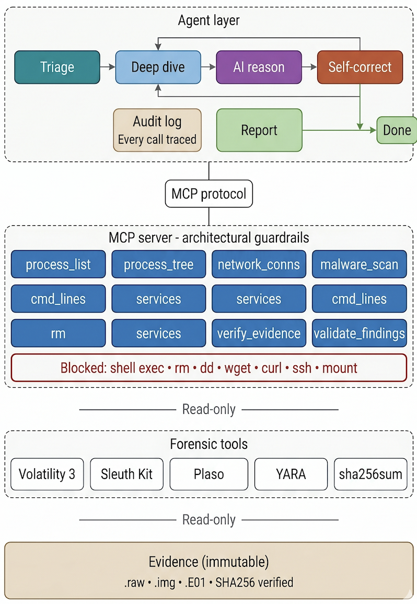

# 🔍 SIFT MCP Forensic Agent

> Autonomous incident response agent with architectural guardrails — built for the [Find Evil! Hackathon 2026](https://findevil.devpost.com)

[](./LICENSE)
[](https://python.org)
[](https://www.sans.org/tools/sift-workstation)
[](https://modelcontextprotocol.io)

---

## Problem

AI-powered attackers go from initial access to full domain control in [under 8 minutes](https://www.crowdstrike.com/blog/). Human incident responders are still pulling up their toolkit.

[Protocol SIFT](https://github.com/teamdfir/protocol-sift) bridges this gap by connecting AI agents to 200+ forensic tools via [MCP](https://modelcontextprotocol.io). But it gives the AI raw shell access — meaning the AI can hallucinate destructive commands and corrupt evidence.

## Solution

Two layers:

**Layer 1 → MCP Server (architectural guardrails)**
Wraps forensic tools as typed, safe Python functions. The AI calls `get_process_list()` not `execute_shell_cmd("vol -f img pslist")`. Destructive commands don't exist in the server's API surface.

**Layer 2 → LangGraph Agent (self-correcting investigator)**
A [LangGraph](https://langchain-ai.github.io/langgraph/) state machine that triages evidence, analyzes findings, validates its own work against the evidence, and loops back when something doesn't add up.

---

## Quick Start

**Prerequisites:** Ubuntu 22.04 (or [SIFT Workstation](https://www.sans.org/tools/sift-workstation)), Python 3.10+, [Volatility 3](https://github.com/volatilityfoundation/volatility3), [Sleuth Kit](https://sleuthkit.org/)

```bash
# Clone
git clone https://github.com/Anjali9815/sift-mcp-forensics.git
cd sift-mcp-forensics

# Install dependencies
pip3 install mcp langgraph langchain-groq langchain-core streamlit

# Set API key (free at console.groq.com)
export GROQ_API_KEY="your-key"

# Run the agent
python3 src/agent.py /path/to/memory-image.raw

# Or launch the dashboard
streamlit run src/app.py --server.port 8501 --server.address 0.0.0.0
```

---

## How It Works

```
Evidence (.raw)
     ↓
 SHA256 hash ── chain of custody
     ↓
 ┌─ Triage ─────── processes, system info
 │    ↓
 │  Deep Dive ──── network, malware, services
 │    ↓
 │  AI Analysis ── anomaly detection (Groq/LLaMA)
 │    ↓
 │  Self-Correct ── validate PIDs, check gaps
 │    ↓    ↑
 │    ↓  loop if gaps found (max 3)
 │    ↓
 └─ Report ─────── confirmed vs inferred findings
```

---

## MCP Tools

11 typed functions — no raw shell access:

| Tool | Purpose | Wraps |
|------|---------|-------|
| `get_process_list` | Running processes | [Volatility](https://github.com/volatilityfoundation/volatility3) `windows.pslist` |
| `get_process_tree` | Parent-child relationships | Volatility `windows.pstree` |
| `get_command_lines` | Process arguments | Volatility `windows.cmdline` |
| `get_network_connections` | Network activity | Volatility `windows.netscan` |
| `scan_for_malware` | Code injection detection | Volatility `windows.malfind` |
| `get_services` | Windows services | Volatility `windows.svcscan` |
| `get_image_info` | OS and system metadata | Volatility `windows.info` |
| `verify_evidence` | SHA256 chain of custody | `sha256sum` |
| `list_files` | Disk image file listing | [Sleuth Kit](https://sleuthkit.org/) `fls` |
| `validate_findings` | Cross-check against evidence | Custom validation |
| `get_system_info` | Workstation details | Python `platform` |

Each tool: validates input → executes command → parses output → returns structured data → logs with timestamp.

---
## Architecture



📐 **Detailed diagrams:** [Agent Flow](./docs/images/agent_flow.png) · [MCP Security](./docs/images/mcp_security.png) · [Data Pipeline](./docs/images/data_flow.png) · [Full writeup](./docs/architecture.md)

## Why Architectural Guardrails Matter

Default [Protocol SIFT](https://github.com/teamdfir/protocol-sift) uses a `settings.json` permission file — a prompt-based approach that says "please don't run dangerous commands.

Our MCP server enforces safety architecturally:

| | Protocol SIFT Default | Our MCP Server |
|---|---|---|
| Dangerous commands | "Denied" in JSON config | **Don't exist as functions** |
| Evidence protection | Prompt instruction | **Input validation + read-only** |
| Output to AI | Raw terminal text | **Parsed structured data** |
| Hallucination risk | AI constructs shell commands | **AI calls typed functions** |

This distinction is central to the [hackathon's Constraint Implementation criterion](https://findevil.devpost.com).

---

## Results: Rocba Case

Tested against the **Rocba Memory Image** (18 GB) from the hackathon's [Standard Forensic Case](https://sansorg.egnyte.com/fl/HhH7crTYT4JK).

**What the agent found:**
- ✅ Windows 10, build 19041, user `fredr`, captured 2020-11-16
- 🚨 **MRC.exe** running from `D:\Tools\` — likely remote access tool
- 🚨 **1000+ Teams.exe** processes — anomalous count
- ⚠️ Three cloud sync services active (OneDrive, Google Drive, iCloud)
- ⚠️ iCloud Photos syncing Disney vacation photos — confirms timeline

**What the agent got wrong (documented honestly):**
- ❌ Flagged Slack.exe and Chrome.exe as suspicious — false positives
- ❌ Missed MRC.exe initially due to token truncation
- ❌ Referenced wrong tool names ("tasklist.exe" instead of Volatility)

All hallucinations documented in the [accuracy report](./docs/accuracy_report.md). As the hackathon rules state: *"Honesty valued over perfection."*

---

## Project Structure

```
sift-mcp-forensics/
├── README.md                  ← You are here
├── LICENSE                    ← MIT License
├── src/
│   ├── server.py              ← MCP Server (11 typed tools)
│   ├── agent.py               ← LangGraph self-correcting agent
│   └── app.py                 ← Streamlit investigation dashboard
├── docs/
│   ├── architecture.md        ← System design + trust boundaries
│   ├── dataset.md             ← Evidence documentation
│   └── accuracy_report.md     ← Hallucination analysis
├── submission/
│   └── execution_logs/        ← Full tool traces (JSON + timestamps)
└── test_tool.py               ← Tool verification tests
```

---

## Submission Compliance

| # | Requirement | Location | Status |
|---|-------------|----------|--------|
| 1 | Public GitHub repo | [This repo](https://github.com/Anjali9815/sift-mcp-forensics) | ✅ |
| 2 | Open source license | [LICENSE](./LICENSE) | ✅ |
| 3 | README + setup | [Quick Start](#quick-start) | ✅ |
| 4 | Try-it-out instructions | [Quick Start](#quick-start) | ✅ |
| 5 | Project description | [This README](#problem) | ✅ |
| 6 | Demo video | [YouTube link] | ✅ |
| 7 | Architecture diagram | [docs/architecture.md](./docs/architecture.md) | ✅ |
| 8 | Dataset documentation | [docs/dataset.md](./docs/dataset.md) | ✅ |
| 9 | Accuracy report | [docs/accuracy_report.md](./docs/accuracy_report.md) | ✅ |
| 10 | Execution logs | [submission/execution_logs/](./submission/execution_logs/) | ✅ |

---

## Tech Stack

[Python](https://python.org) · [MCP](https://modelcontextprotocol.io) · [LangGraph](https://langchain-ai.github.io/langgraph/) · [LangChain](https://langchain.com) · [Groq](https://groq.com) · [Volatility 3](https://github.com/volatilityfoundation/volatility3) · [Sleuth Kit](https://sleuthkit.org/) · [SANS SIFT](https://www.sans.org/tools/sift-workstation) · [Google Cloud](https://cloud.google.com)

---

## References

- [Find Evil! Hackathon](https://findevil.devpost.com) — SANS Institute, 2026
- [Protocol SIFT](https://github.com/teamdfir/protocol-sift) — Rob Lee, SANS DFIR
- [Model Context Protocol](https://modelcontextprotocol.io) — Anthropic
- [SANS SIFT Workstation](https://www.sans.org/tools/sift-workstation) — 200+ forensic tools, 18 years of community development
- [Volatility 3](https://github.com/volatilityfoundation/volatility3) — Memory forensics framework
- [The Sleuth Kit](https://sleuthkit.org/) — Disk forensics toolkit
- [LangGraph](https://langchain-ai.github.io/langgraph/) — Agent state machine framework
- [DFIR+AI: How to Combat Hallucinations](https://www.cybertriage.com/blog/dfir-ai-primer-how-to-combat-hallucinations/) — Cyber Triage
- [Hackathon Slack](https://sansaihackathon.slack.com) — Community discussion and mentor support
- [CrowdStrike 2024 Threat Report](https://www.crowdstrike.com/global-threat-report/) — Breakout time benchmarks
- [Digital Forensics & Incident Response](https://en.wikipedia.org/wiki/Digital_forensics) — Wikipedia

---

## Author

**Anjali Jha**
MS in Data Science & AI, University of Maryland Baltimore County (2026)
[GitHub](https://github.com/Anjali9815) · [LinkedIn](https://www.linkedin.com/in/anjali-jha-069aa6184/)

## License

[MIT](./LICENSE) — Open source, free to use and extend.
